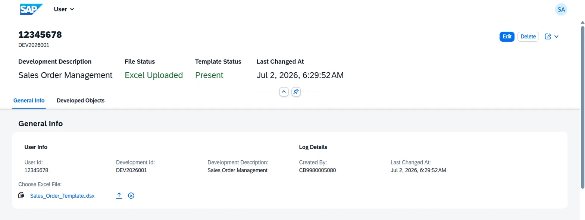
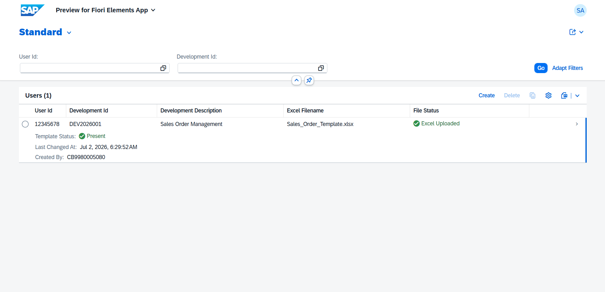
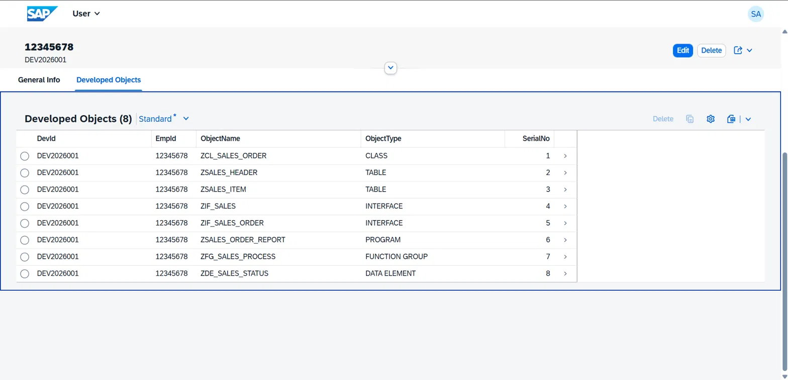

# SAP RAP Excel Upload & Download

Every SAP project ends the same way — someone's tracking development objects in a spreadsheet. This fixes that.

**Demo:** [Full walkthrough video on LinkedIn](https://www.linkedin.com/posts/shagul737_sap-abap-saprap-ugcPost-7478253946944462850-g_Zy/)

The app is built entirely on SAP RAP — no classic ABAP, no external plugins, nothing outside of ABAP Cloud. The idea is straightforward: a team lead opens the app in Fiori, creates a record for a developer, downloads a pre-generated Excel template, fills in the development objects, uploads it back, and the system automatically reads the file and saves every row as a structured record. That's the whole flow.

On the technical side, it's a managed RAP business object with a parent-child composition. The parent table stores the developer's ID, development ID, and the Excel file itself as a raw binary field. The child table stores the parsed object rows — object type, object name, serial number. The entire thing is exposed through an OData V2 service binding with a Fiori Elements List Report and Object Page.

The two main pieces of custom logic are the `downloadExcel` and `uploadExcelData` actions. Download uses the `xco_cp_xlsx` write API to create an empty .xlsx template with the right column headers and saves it directly into the Attachment field. Upload does the reverse — reads the binary attachment, opens it with the `xco_cp_xlsx` read API, parses every data row from column A to E starting at row 2, and creates child records with sequential serial numbers using `CREATE BY \_UserDev`. There are also two determinations that auto-update the File Status field whenever the attachment changes or a new record is created, and `get_instance_features` handles the button logic — Upload Data only shows when a file is attached, Download Excel only shows when no template exists yet.

One thing that tripped me up: `@Semantics.largeObject` alone doesn't make the file upload control render properly in OData V2. You need `@Semantics.mimeType: true` on the MimeType field as well — both annotations are required as a pair. Also, the `xco_cp_xlsx` read method is called `write_to()` which makes zero sense until you realise it means "write into this ABAP table", not "write to Excel". And if you're thinking about using OData V4 — don't, not for a non-draft RAP object. Fiori Elements V4 treats it as read-only and the Create button simply won't appear.

The whole thing is version controlled through abapGit and pushed here. If you want to run it, create a package in your system, link this repo through the abapGit ADT plugin, pull the objects, activate them in dependency order starting from the tables, and publish the `ZUI_EXCEL_UPL_V2` service binding. That's it.

**Tech used:** SAP BTP ABAP Environment, SAP RAP (managed non-draft), CDS Views, Behavior Definitions, xco_cp_xlsx API, OData V2, Fiori Elements, Eclipse ADT, abapGit
